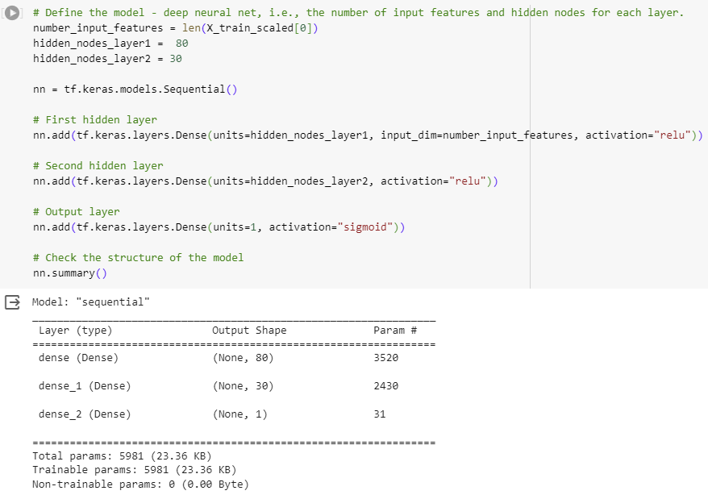
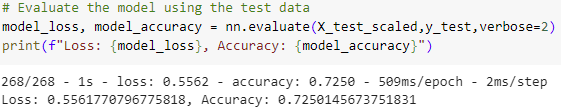
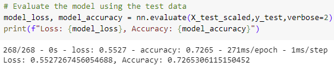
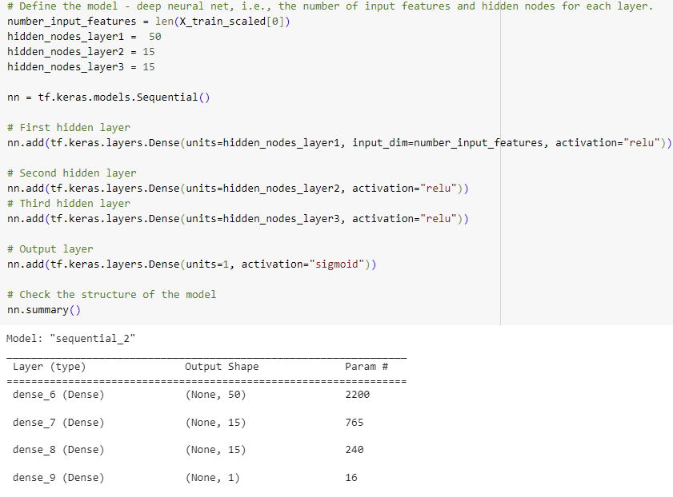
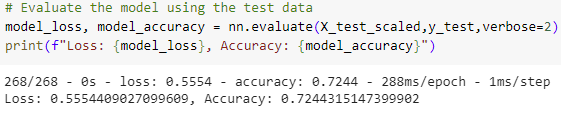
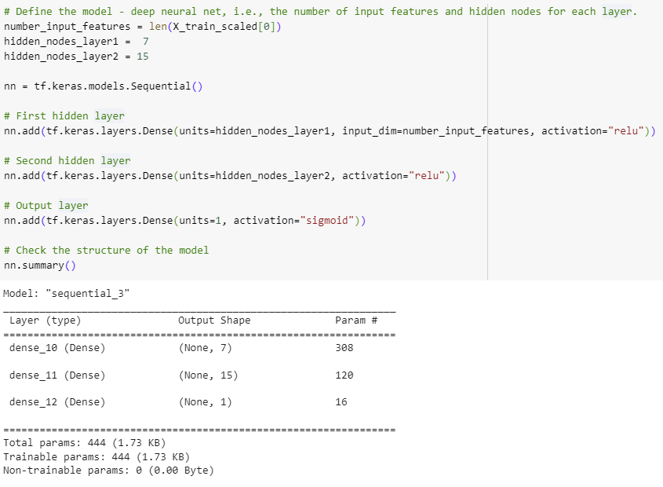
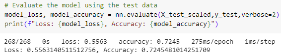

# Deep-Learning

## Overview 

Alphabet Soup, a nonprofit foundation, is seeking a tool to assist in the targeted selection of funding applicants with the highest likelihood of success. Leveraging machine learning and neural networks, the task is to utilize the features within the provided dataset to develop a binary classifier. This classifier will be designed to predict whether applicants stand a good chance of success when receiving funding from Alphabet Soup.

Dataset: a CSV file (charity_data.csv) encompassing information on more than 34,000 organizations which have received funding from Alphabet Soup throughout the years. 

## Data Preprocessing

This dataset includes various columns capturing metadata about each organization:
1. Identification columns like EIN and NAME 
2. Alphabet Soup application type (APPLICATION_TYPE)
3. Affiliated sector of industry (AFFILIATION)
4. Government organization classification (CLASSIFICATION)
5. Use case for funding (USE_CASE)
6. Organization type (ORGANIZATION)
7. Active status (STATUS)
8. Income classification (INCOME_AMT)
9. Special considerations for application (SPECIAL_CONSIDERATIONS)
10. Funding amount requested (ASK_AMT)
11. Effectiveness of the funding usage (IS_SUCCESSFUL).

* The 'EIN' and 'NAME' columns are removed because they are not necessary to train the model.

* 'IS_SUCCESSFUL' is the target variable. This will allow to build a deep learning model to predict the successful campaigns.

## Compiling, Training, and Evaluating the Model

In the initial neural network model, a two-layer architecture with specific parameters for the number of neurons, layers, and activation functions were used. The first hidden layer comprised 80 neurons (hidden_nodes_layer1 = 80), the second hidden layer had 30 neurons (hidden_nodes_layer2 = 30), and both hidden layers utilized the ReLU activation function (activation="relu"). This configuration of the neural network was selected to capture and comprehend meaningful patterns within the data. The ReLU activation function facilitated the introduction of non-linearity. A solitary neuron in the output layer (units=1) was employed using the sigmoid activation function (activation="sigmoid") to address the binary classification. The sigmoid activation function effectively maps a range between 0 and 1, which is useful in detecting probability.

**Model Accuracy - 72.5%**

This model was not able to acheive the target of 75% accuracy.

## Attempts to increase model performance

### Optimization 1 - Adjust the number nodes per layer

    i. Adjusting nodes from 80 to 50 in layer 1.
    ii. Adjusting nodes from 30 to 15 in layer 2.

#### **Accuracy = 72.65% (almost no change)**

### Optimization 2 - Adjust the number of layers

    i. Add third layer with same nodes as second layer in Optimization 1.

#### **Accuracy = 72.44% (almost no change)**

### Optimization 3 - Adjust the number drastically of nodes per layers

    i. Adjusting nodes from 80 to 7 in layer 1.
    ii. Adjusting nodes from 30 to 15 in layer 2.

#### **Accuracy = 72.45% (almost no change)**

## Summary 
The overall results show the attempts to improve the model through optimization were minimal at best, and they did not reach the target of 75% accuracy. Although all the accuracy results were similar, the neural network that had the highest accuracy was Optimization 1 and this would be the recommended model to use with this dataset. 

Further work could clarify the neccessary architechure of the neural network using 'keras_tuner' to find the hyperparameters that are the best fit for this model.

